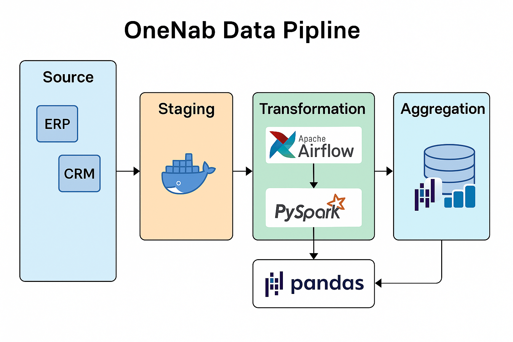

# โครงการ OneNab Data Pipeline



คลังนี้เป็นการติดตั้งเฟรมเวิร์ก ETL (Extract, Transform, Load) ฉบับครบวงจรสำหรับคลังข้อมูล **OneNab** โดยอัตโนมัติการดึงข้อมูลประจำวัน การสรุปผล และการดูแลรักษาชุดข้อมูลเชิงปฏิบัติการ (เช่น ค่าตัวเลข AOP และข้อมูลใบแจ้งหนี้) เพื่อให้ระบบต้นทางส่งข้อมูลที่สะอาดและทันเวลาไปยังแพลตฟอร์มการวิเคราะห์และการรายงาน

## วัตถุประสงค์

* **อัตโนมัติการไหลของข้อมูล** จากระบบต้นทางไปยังชั้น staging และ mart
* **แปลงข้อมูลดิบ** (เช่น ยอดขาย ใบแจ้งหนี้ มิติต่างๆ) ให้เป็นตารางที่สอดคล้องกัน
* **สร้างเมตริกสรุป** (เช่น จำนวนสาขาที่ใช้งานตามเดือน, ประสิทธิภาพของสินทรัพย์) สำหรับงาน Business Intelligence
* **บำรุงรักษามิติมาสเตอร์** เพื่อให้การเชื่อมตารางข้าม pipeline มีความสอดคล้อง

## เครื่องมือที่ใช้

* **Apache Airflow (v2.x)**: จัดการ workflow และการตั้งเวลา
* **Python (3.7+)**: เขียนสคริปต์ทั่วไปและนิยาม DAG
* **PySpark**: ประมวลผลข้อมูลขนาดใหญ่แบบกระจาย
* **pandas**: ประมวลผลข้อมูลขนาดเล็กในหน่วยความจำ และสร้าง pivot table
* **SQLAlchemy**, **pymssql**, **pyodbc**: เชื่อมต่อฐานข้อมูล SQL Server และ RDBMS อื่นๆ
* **Docker & Docker Compose**: สร้างคอนเทนเนอร์สำหรับ Airflow และบริการอื่นๆ
* **JSON**: ไฟล์ตั้งค่าภายนอกสำหรับปรับพารามิเตอร์งาน

## โครงสร้างโปรเจกต์

```bash
.
├── OneNab/                 # โฟลเดอร์ Airflow DAG definitions
├── files/                  # สคริปต์ Python สำหรับแปลงข้อมูล
├── json/                   # แม่แบบตั้งค่าการเชื่อมต่อและเส้นทางไฟล์
├── text/                   # แม่แบบข้อความและตัวช่วย logging
├── README.md               # ไฟล์นี้
└── requirements.txt        # รายการ dependency ของ Python
```

## ความต้องการล่วงหน้า (Prerequisites)

* ติดตั้ง Docker และ Docker Compose
* สภาพแวดล้อม Python 3.7 ขึ้นไป
* ตั้งค่า Airflow connections และ variables ให้เรียบร้อย
* ฐานข้อมูลเป้าหมาย (เช่น SQL Server) สามารถเข้าถึงได้ด้วยสิทธิ์ที่ถูกต้อง

## การติดตั้งและใช้งาน

1. โคลนและเข้าสู่โฟลเดอร์โปรเจกต์:

   ```bash
   ```

git clone  cd one-nab

````
2. (ถ้ามี) เรียกใช้ Docker Compose:
   ```bash
docker-compose up -d  # สตาร์ท Airflow scheduler, webserver, database
````

3. สร้าง virtual environment และติดตั้ง dependencies:

   ```bash
   ```

python -m venv venv source venv/bin/activate    # Linux/macOS venv\Scripts\activate   # Windows pip install -r requirements.txt

````
4. คัดลอกโฟลเดอร์ `OneNab` ไปยัง `dags_folder` ของ Airflow หรือปรับตัวแปร `AIRFLOW__CORE__DAGS_FOLDER`
5. (ถ้าไม่ใช้ Docker) สตาร์ท Airflow Scheduler และ Webserver:
   ```bash
airflow scheduler &
airflow webserver
````

6. เรียกใช้งานหรือกำหนดเวลารัน DAG ผ่าน UI หรือ CLI:

   ```bash
   ```

airflow dags trigger Dag\_OneNab\_JobAllAOPDaily

```

## DAGs & สคริปต์สำคัญ

| ชื่อ DAG                                 | บทบาท                                          |
|-------------------------------------------|-----------------------------------------------|
| `Dag_OneNab_JobAllAOPDaily`               | ดึงและประมวลผลข้อมูล AOP ประจำวัน             |
| `Dag_OneNab_JobDailyAGG`                  | คำนวณการสรุปผลรายวัน                          |
| `Dag_OneNab_JobMaster`                    | โหลด/อัปเดตมิติมาสเตอร์                       |
| `Dag_OneNab_SSC_FactAllDataInvoice`       | แปลงและโหลดข้อมูลใบแจ้งหนี้                     |
| `Dag_OneNab_SSC_FactAllDataInvoice_Delete`| ลบข้อมูลใบแจ้งหนี้เก่าก่อนช่วงเวลาที่กำหนด    |

สคริปต์ Python สำหรับแปลงข้อมูลอยู่ในโฟลเดอร์ `files/` เช่น:

- **OneNab_SCC_AggActOutletYM.py**: สรุปจำนวนสาขาที่ใช้งานตามปี-เดือน
- **OneNab_SSC_FactAllDataInvoice.py**: แยกแยะข้อมูลใบแจ้งหนี้และเขียนลงใน fact table

---

*สำหรับผู้ร่วมพัฒนา: Fork โปรเจกต์, สร้าง feature branch, แล้วส่ง Pull Request ตามแนวทางการพัฒนา*

```
